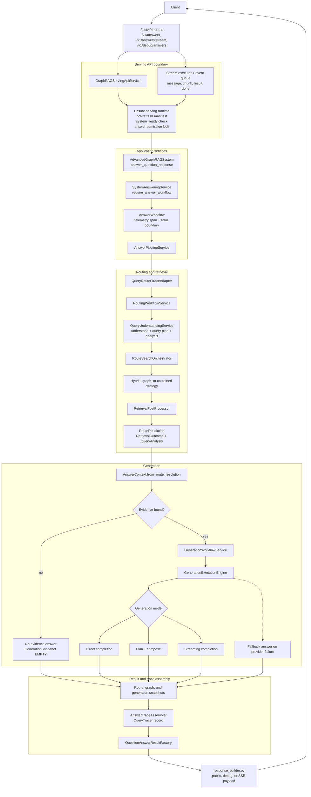
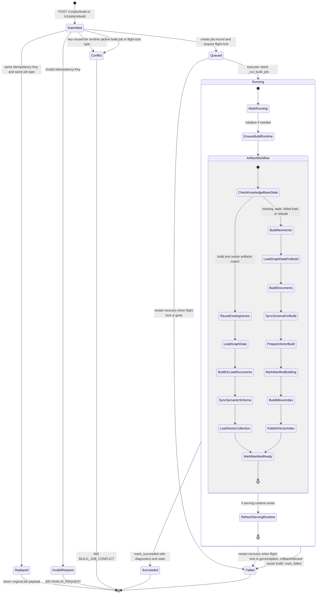

# Architecture Overview

This document maps the main runtime boundaries for GraphRAG C9. It is meant as a
reading guide for new contributors and reviewers; the code remains the source of
truth when behavior changes.

The three diagrams focus on:

- runtime assembly: how API surfaces resolve providers, lifecycles, and active runtimes;
- query-to-answer: how an online request becomes a grounded answer payload;
- build workflow: how build API jobs move through durable state and artifact preparation.

## Runtime Assembly

Runtime assembly starts at the FastAPI factories, but the canonical application
entry is `create_application_system`. The assembler hides provider and
bootstrapper internals behind a small `ApplicationContainer`, while
`SystemRuntimeManager` owns the active build and serving runtime state.

```mermaid
flowchart TB
  subgraph Entry["API entrypoints"]
    ServingApp["create_serving_api_app<br/>GraphRAGServingApiService"]
    BuildApp["create_build_api_app<br/>GraphRAGBuildApiService"]
  end

  subgraph AppFacade["Application facade"]
    CreateSystem["create_application_system"]
    Assembler["ApplicationAssembler"]
    System["AdvancedGraphRAGSystem"]
  end

  subgraph Composition["Composition root"]
    SystemComposer["AdvancedGraphRAGSystemComposer"]
    ProviderSurface["RuntimeProviderSurface"]
    BootSurface["SystemBootstrapperSurfaceComposer"]
    LifecycleBundle["RuntimeLifecycleServiceBundle"]
    RuntimeInfra["SystemRuntimeInfrastructure"]
  end

  subgraph Providers["Provider facets"]
    Infrastructure["infrastructure"]
    BuildPipeline["build_pipeline"]
    Diagnostics["diagnostics"]
    Lifecycle["lifecycle"]
    Generation["generation"]
    QueryUnderstanding["query_understanding"]
    Retrieval["retrieval"]
    Services["services"]
  end

  subgraph Lifecycles["Runtime lifecycle services"]
    BuildFactory["BuildRuntimeFactory"]
    BuildExecutor["BuildRuntimeExecutor"]
    ServingFactory["ServingRuntimeFactory"]
    ServingPreparer["ServingRuntimePreparer"]
    Initialization["RuntimeInitializationService"]
    Readiness["RuntimeReadinessService"]
    Refresh["ServingRuntimeRefreshService"]
    BuildLifecycle["BuildRuntimeLifecycleService"]
  end

  subgraph ActiveState["Active runtime state"]
    Manager["SystemRuntimeManager"]
    StateStore["RuntimeStateStore"]
    BuildRuntime["BuildRuntime<br/>Neo4j, graph data, vector index,<br/>KnowledgeBaseService, manifest"]
    ServingRuntime["ServingRuntime<br/>query tracer, retrieval engines,<br/>router, generation, AnswerWorkflow"]
    RuntimeView["SystemRuntime view"]
  end

  ServingApp --> CreateSystem
  BuildApp --> CreateSystem
  CreateSystem --> Assembler --> SystemComposer
  SystemComposer --> ProviderSurface
  ProviderSurface --> Infrastructure
  ProviderSurface --> BuildPipeline
  ProviderSurface --> Diagnostics
  ProviderSurface --> Lifecycle
  ProviderSurface --> Generation
  ProviderSurface --> QueryUnderstanding
  ProviderSurface --> Retrieval
  ProviderSurface --> Services
  SystemComposer --> BootSurface
  BootSurface --> BuildFactory
  BootSurface --> BuildExecutor
  BootSurface --> ServingFactory
  BootSurface --> ServingPreparer
  SystemComposer --> LifecycleBundle
  LifecycleBundle --> Initialization
  LifecycleBundle --> Readiness
  LifecycleBundle --> Refresh
  LifecycleBundle --> BuildLifecycle
  SystemComposer --> RuntimeInfra --> Manager
  Manager --> StateStore
  Initialization --> BuildFactory --> BuildRuntime
  Initialization --> ServingFactory --> ServingRuntime
  ServingPreparer --> ServingRuntime
  BuildLifecycle --> BuildExecutor --> BuildRuntime
  BuildLifecycle --> Refresh
  StateStore --> BuildRuntime
  StateStore --> ServingRuntime
  StateStore --> RuntimeView
  Assembler --> System
  System --> Manager
```

Primary code paths:

- `rag_modules/app/assembly.py` creates the application container and facade.
- `rag_modules/app/composition/system_composer.py` resolves providers,
  bootstrappers, lifecycle services, diagnostics, shutdown, and facade support.
- `rag_modules/app/composition/runtime_manager.py` coordinates build and serving
  runtime lifecycle operations.
- `rag_modules/app/composition/build_runtime_factory.py` and
  `rag_modules/app/composition/serving_runtime_factory.py` assemble the two
  runtime object graphs.
- `rag_modules/app/composition/serving_runtime_preparer.py` loads persisted
  artifacts and initializes retrieval engines for serving readiness.

## Query-To-Answer Flow

The serving API keeps HTTP concerns at the boundary. Runtime readiness, hot
refresh, admission control, routing, retrieval, generation, trace capture, and
public/debug response shaping are separate steps.

Primary code paths:

- `rag_modules/interfaces/api/routes.py` owns HTTP routes and public/debug/SSE
  response selection.
- `rag_modules/interfaces/api/services/serving.py` owns readiness checks,
  hot-refresh checks, backpressure, and streaming event coordination.
- `rag_modules/app/composition/system_answering_service.py` bridges the
  application facade to the initialized `AnswerWorkflow`.
- `rag_modules/app/services/answer_workflow.py` and
  `rag_modules/app/services/answer_pipeline.py` own answer orchestration.
- `rag_modules/routing/workflow_service.py` owns query understanding, route
  execution, retrieval post-processing, and route trace capture.
- `rag_modules/generation/service.py` and
  `rag_modules/generation/execution/engine.py` own grounded answer generation,
  mode selection, streaming, retries, and fallback behavior.

## Build Workflow State Machine

The persisted build-job statuses are `queued`, `running`, `succeeded`, and
`failed`. The other states below describe HTTP submission outcomes or internal
work inside a running job.

Primary code paths:

- `rag_modules/interfaces/api/routes.py` registers `/jobs/build`,
  `/jobs/rebuild`, and compatibility aliases.
- `rag_modules/interfaces/api/services/build.py` owns submission locks,
  idempotency validation, executor submission, `_run_build_job`, and job result
  snapshots.
- `rag_modules/interfaces/api/build_jobs/repository.py` owns durable job
  records, idempotency indexes, retention, recovery, pagination, and corruption
  warnings.
- `rag_modules/app/composition/build_runtime_lifecycle_service.py` executes
  build/rebuild and refreshes serving runtime state from a completed build.
- `rag_modules/build_pipeline/knowledge_base_workflow.py` owns artifact reuse,
  rebuild, vector publish/rollback, schema sync, manifest transitions, and
  build statistics.
