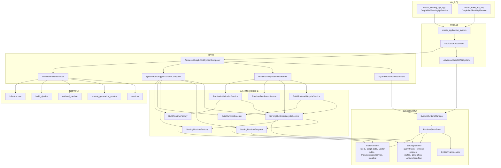
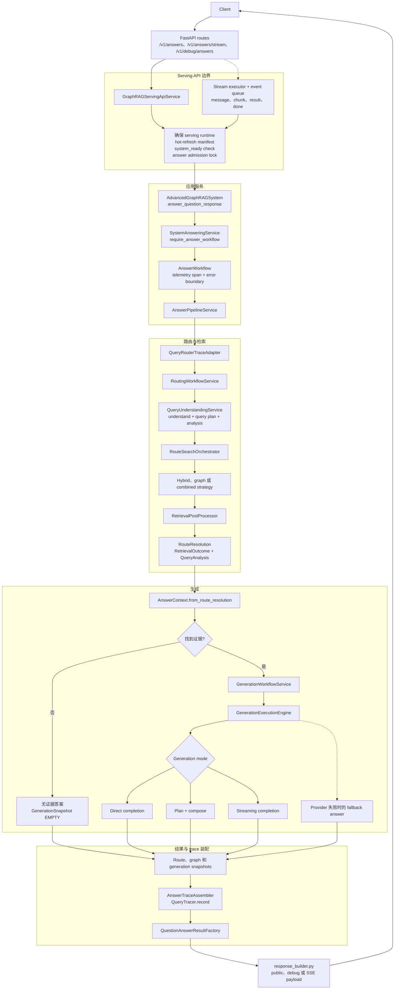
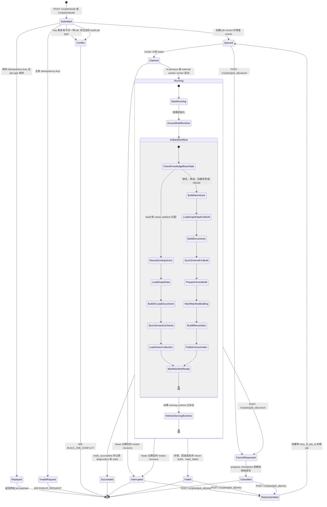

# 架构概览

本文档梳理 GraphRAG C9 的主要运行时边界。它面向新贡献者和 reviewer，作为阅读指南使用；
当行为发生变化时，代码仍然是最终准绳。

## 请求生命周期最短阅读路线

如果目标只是理解一次 `/v1/answers` 请求如何穿过系统，先按下面顺序阅读。它刻意绕开
composition/provider/factory/lifecycle 的完整展开，等请求主线建立起来后再回头看装配细节。

1. `rag_modules/interfaces/api/app.py`：确认 FastAPI app factory 如何创建
   `GraphRAGServingApiService`、注册 middleware、错误处理和 serving routes。
2. `rag_modules/interfaces/api/serving_routes.py` 和 `rag_modules/interfaces/api/route_handlers.py`：
   从 `/v1/answers`、`/v1/answers/stream`、`/v1/debug/answers` 看 HTTP route 如何选择普通、
   streaming、public 或 debug 响应。
3. `rag_modules/interfaces/api/services/serving.py`：看 HTTP-facing 服务如何做 serving runtime
   初始化校验、hot refresh、`system_ready` 检查、answer admission lock 和 SSE runner 分发。
4. `rag_modules/app/system.py` 和 `rag_modules/app/composition/system_answering_service.py`：
   看应用 facade 如何把请求转给当前 serving runtime 上的 `AnswerWorkflow`。
5. `rag_modules/application/answering/answer_workflow.py` 和
   `rag_modules/application/answering/answer_pipeline.py`：这是请求主干。这里创建 request control，
   包住 telemetry/error boundary，执行 routing、generation、trace capture 和 result factory。
6. `rag_modules/routing/workflow_service.py`：理解 query understanding、route execution request、
   hybrid/graph/combined 检索、post-processing 和 route trace 是如何组成 `RouteResolution` 的。
7. `rag_modules/generation/service.py` 和 `rag_modules/generation/execution/engine.py`：
   看 `AnswerContext` 如何进入 direct、two-stage 或 streaming generation，以及 provider 失败时如何
   fallback。
8. `rag_modules/interfaces/api/response_builder.py` 和
   `rag_modules/interfaces/api/answer_*_models.py`：最后看 debug payload 如何被压成 public response，
   或被编码为 SSE events。

读完这条路径后，再根据问题类型补读装配层：

- 想知道某个 collaborator 从哪里来，读 `rag_modules/app/providers/`。
- 想知道 serving runtime 对象图怎么拼出来，读
  `rag_modules/app/composition/serving_runtime_factory.py`。
- 想知道 artifacts 如何让 runtime 变 ready，读
  `rag_modules/app/composition/serving_runtime_lifecycle_service.py` 和
  `rag_modules/app/composition/serving_runtime_preparer.py`。
- 想判断一次改动该落在哪个 provider、factory 或 lifecycle 文件，读
  `docs/app_composition_maintenance_guide.md`。

三个图分别关注：

- 运行时装配：API 表面如何解析 providers、生命周期和活跃 runtime；
- 从 query 到 answer：线上请求如何变成带 grounding 的答案 payload；
- 构建工作流：构建 API job 如何穿过持久状态并准备 artifact。

## 运行时装配

运行时装配从 FastAPI factory 开始，但规范应用入口是 `create_application_system`。
assembler 通过小型 `ApplicationContainer` 隐藏 provider 和 bootstrapper 内部细节；
`SystemRuntimeManager` 负责持有活跃 build runtime 和 serving runtime 状态。

`rag_modules.application` is the canonical Python import surface for answer and
knowledge-base use cases. `rag_modules.app.services` contains only runtime
diagnostics and shutdown services; it does not forward application use cases or
DTOs. Public bootstrappers delegate directly to collaborators resolved by the
composition roots and do not insert invocation adapters.

## Foundation-boundary ratchets

Configuration has exactly eight Python modules: `__init__.py`, `assembly.py`,
`env.py`, `environment_schema.py`, `loader.py`, `models.py`, `profiles.py`,
and `validation.py`. All configuration entry points follow one loader flow:
environment variables, TOML profile data, and explicit overrides become
JSON-shaped nested data, are merged and validated in precedence order, then
produce `GraphRAGConfig`. There are no section-specific loader modules.

The contract kernel accepts unvalidated mapping input as `Mapping[str, object]`
and normalizes JSON output through `JsonObject`/`JsonValue`. LangChain
`Document` conversion occurs only at `rag_modules.langchain_document_adapter`;
the adapter produces `TextDocument` or `EvidenceDocument` before values enter
retrieval, evidence processing, or generation. The retired `PageDocumentLike`
surface and the deprecated `EvidenceDocument` recipe aliases (`recipe_id`,
`recipe_name`, `recipe_graph_evidence`, and `_legacy_recipe_compat`) are not
part of the internal contract.

The foundation layer retains exactly two substitution seams:
`BuildJobRepositoryPort` (file-backed or externally supplied job persistence)
and `BuildJobRunnerPort` (in-process or external-worker execution). No other
foundation Protocol is a canonical abstraction.

provider 边界刻意保持狭窄。`RuntimeProviderSurface` 只暴露当前 facet：
`infrastructure`、`build_pipeline`、`retrieval_runtime`、顶层 `provide_generation_module`
和 `services`。Query understanding 属于 retrieval-runtime facet，因为 routing 会同时消费两者；
diagnostics、stats、shutdown、knowledge-base 和 answer workflow 构造属于 `services`；
生命周期转换留在 `rag_modules/app/composition` 中。不要重新创建已退役的
`rag_modules/app/provider_components` 包，也不要恢复独立的 `query_understanding`、`lifecycle`
或 `diagnostics` provider facet。

```mermaid
flowchart TB
  subgraph Entry["API 入口"]
    ServingApp["create_serving_api_app<br/>GraphRAGServingApiService"]
    BuildApp["create_build_api_app<br/>GraphRAGBuildApiService"]
  end

  subgraph AppFacade["应用外观"]
    CreateSystem["create_application_system"]
    Assembler["ApplicationAssembler"]
    System["AdvancedGraphRAGSystem"]
  end

  subgraph Composition["组合根"]
    SystemComposer["AdvancedGraphRAGSystemComposer"]
    ProviderSurface["RuntimeProviderSurface"]
    BootSurface["SystemBootstrapperSurfaceComposer"]
    LifecycleBundle["RuntimeLifecycleServiceBundle"]
    RuntimeInfra["SystemRuntimeInfrastructure"]
  end

  subgraph Providers["提供方切面"]
    Infrastructure["infrastructure"]
    BuildPipeline["build_pipeline"]
    RetrievalRuntime["retrieval_runtime"]
    Generation["provide_generation_module"]
    Services["services"]
  end

  subgraph Lifecycles["运行时生命周期服务"]
    BuildFactory["BuildRuntimeFactory"]
    BuildExecutor["BuildRuntimeExecutor"]
    ServingFactory["ServingRuntimeFactory"]
    ServingPreparer["ServingRuntimePreparer"]
    ServingLifecycle["ServingRuntimeLifecycleService"]
    Initialization["RuntimeInitializationService"]
    Readiness["RuntimeReadinessService"]
    BuildLifecycle["BuildRuntimeLifecycleService"]
  end

  subgraph ActiveState["活跃运行时状态"]
    Manager["SystemRuntimeManager"]
    StateStore["RuntimeStateStore"]
    BuildRuntime["BuildRuntime<br/>Neo4j、graph data、vector index、<br/>KnowledgeBaseService、manifest"]
    ServingRuntime["ServingRuntime<br/>query tracer、retrieval engines、<br/>router、generation、AnswerWorkflow"]
    RuntimeView["SystemRuntime view"]
  end

  ServingApp --> CreateSystem
  BuildApp --> CreateSystem
  CreateSystem --> Assembler --> SystemComposer
  SystemComposer --> ProviderSurface
  ProviderSurface --> Infrastructure
  ProviderSurface --> BuildPipeline
  ProviderSurface --> RetrievalRuntime
  ProviderSurface --> Generation
  ProviderSurface --> Services
  SystemComposer --> BootSurface
  BootSurface --> BuildFactory
  BootSurface --> BuildExecutor
  BootSurface --> ServingFactory
  BootSurface --> ServingPreparer
  BootSurface --> ServingLifecycle
  SystemComposer --> LifecycleBundle
  LifecycleBundle --> Initialization
  LifecycleBundle --> Readiness
  LifecycleBundle --> ServingLifecycle
  LifecycleBundle --> BuildLifecycle
  SystemComposer --> RuntimeInfra --> Manager
  Manager --> StateStore
  Initialization --> BuildFactory --> BuildRuntime
  Initialization --> ServingLifecycle --> ServingRuntime
  ServingLifecycle --> ServingFactory
  ServingLifecycle --> ServingPreparer
  ServingPreparer --> ServingRuntime
  BuildLifecycle --> BuildExecutor --> BuildRuntime
  BuildLifecycle --> ServingLifecycle
  StateStore --> BuildRuntime
  StateStore --> ServingRuntime
  StateStore --> RuntimeView
  Assembler --> System
  System --> Manager
```

主要代码路径：

- `rag_modules/app/assembly.py` 创建应用 container 和 facade。
- `rag_modules/app/composition/system_composer.py` 解析 providers、bootstrappers、生命周期服务、
  diagnostics、shutdown 和 facade 支撑能力。
- `rag_modules/app/providers/contracts.py` 定义规范 provider facets，默认实现拆分在
  `rag_modules/app/providers/` 下。
- `rag_modules/app/composition/runtime_manager.py` 协调 build runtime 和 serving runtime 生命周期操作。
- `rag_modules/app/composition/build_runtime_factory.py` 和
  `rag_modules/app/composition/serving_runtime_factory.py` 装配两个 runtime 对象图。
- `rag_modules/app/composition/serving_runtime_preparer.py` 加载持久化 artifacts，并初始化用于服务就绪的
  retrieval engines。
- `docs/app_composition_maintenance_guide.md` 将常见能力变更映射到应负责该变更的 provider、factory
  或 lifecycle 文件。

## 从 Query 到 Answer 的流程

服务 API 将 HTTP 关注点留在边界层。Runtime readiness、hot refresh、admission control、routing、
retrieval、generation、trace capture，以及 public/debug response shaping 都是彼此分离的步骤。

```mermaid
flowchart TD
  Client["Client"]
  Routes["FastAPI routes<br/>/v1/answers、/v1/answers/stream、<br/>/v1/debug/answers"]
  ResponseBuilder["response_builder.py<br/>public、debug 或 SSE payload"]

  subgraph Boundary["Serving API 边界"]
    ServingService["GraphRAGServingApiService"]
    Guards["确保 serving runtime<br/>hot-refresh manifest<br/>system_ready check<br/>answer admission lock"]
    StreamRunner["Stream executor + event queue<br/>message、chunk、result、done"]
  end

  subgraph App["应用服务"]
    SystemAnswer["AdvancedGraphRAGSystem<br/>answer_question_response"]
    AnsweringService["SystemAnsweringService<br/>require_answer_workflow"]
    Workflow["AnswerWorkflow<br/>telemetry span + error boundary"]
    Pipeline["AnswerPipelineService"]
  end

  subgraph Routing["路由与检索"]
    RouterTrace["QueryRouterTraceAdapter"]
    RoutingWorkflow["RoutingWorkflowService"]
    Understanding["QueryUnderstandingService<br/>understand + query plan + analysis"]
    Orchestrator["RouteSearchOrchestrator"]
    Strategies["Hybrid、graph 或 combined strategy"]
    PostProcess["RetrievalPostProcessor"]
    Resolution["RouteResolution<br/>RetrievalOutcome + QueryAnalysis"]
  end

  subgraph GenerationFlow["生成"]
    AnswerContext["AnswerContext.from_route_resolution"]
    EvidenceGate{"找到证据?"}
    EmptyAnswer["无证据答案<br/>GenerationSnapshot EMPTY"]
    Generation["GenerationWorkflowService"]
    Engine["GenerationExecutionEngine"]
    Mode{"Generation mode"}
    Direct["Direct completion"]
    TwoStage["Plan + compose"]
    Streaming["Streaming completion"]
    Fallback["Provider 失败时的 fallback answer"]
  end

  subgraph Result["结果与 trace 装配"]
    RuntimeTraces["Route、graph 和 generation snapshots"]
    TraceAssembler["AnswerTraceAssembler<br/>QueryTracer.record"]
    ResultFactory["QuestionAnswerResultFactory"]
  end

  Client --> Routes --> ServingService --> Guards
  Routes -.-> StreamRunner
  StreamRunner --> Guards
  Guards --> SystemAnswer --> AnsweringService --> Workflow --> Pipeline
  Pipeline --> RouterTrace --> RoutingWorkflow
  RoutingWorkflow --> Understanding --> Orchestrator --> Strategies --> PostProcess --> Resolution
  Resolution --> AnswerContext --> EvidenceGate
  EvidenceGate -- "否" --> EmptyAnswer --> RuntimeTraces
  EvidenceGate -- "是" --> Generation --> Engine --> Mode
  Mode --> Direct
  Mode --> TwoStage
  Mode --> Streaming
  Direct --> RuntimeTraces
  TwoStage --> RuntimeTraces
  Streaming --> RuntimeTraces
  Engine -.-> Fallback --> RuntimeTraces
  RuntimeTraces --> TraceAssembler --> ResultFactory --> ResponseBuilder --> Client
```

主要代码路径：

- `rag_modules/interfaces/api/serving_routes.py` 负责 serving HTTP routes，以及 public/debug/SSE 响应选择。
- `rag_modules/interfaces/api/operational_routes.py` 负责 health、readiness、stats、diagnostics
  和 runtime operation routes。
- `rag_modules/interfaces/api/services/serving.py` 负责 readiness checks、hot-refresh checks、
  backpressure 和 streaming event coordination。
- `rag_modules/app/composition/system_answering_service.py` 将应用 facade 连接到已初始化的 `AnswerWorkflow`。
- `rag_modules/application/answering/answer_workflow.py` 和
  `rag_modules/application/answering/answer_pipeline.py`
  负责 answer orchestration。
- `rag_modules/routing/workflow_service.py` 负责 query understanding、route execution、
  retrieval post-processing 和 route trace capture。
- `rag_modules/generation/service.py` 和 `rag_modules/generation/execution/engine.py` 负责 grounded answer
  generation、mode selection、streaming、retries 和 fallback 行为。

## 构建工作流状态机

内部持久化 build-job snapshot 可以是 `queued`、`claimed`、`running`、`cancel_requested`、`succeeded`、
`failed`、`cancelled` 或 `interrupted`。`claimed` 是内部 lease 状态，对外以 `queued` 返回；
`interrupted` 对外以 `failed` 返回。下面的其他状态描述 HTTP 提交结果，或 running job 内部的工作。

```mermaid
stateDiagram-v2
  [*] --> Submitted: POST /v1/jobs/build 或 /v1/jobs/rebuild

  Submitted --> Replayed: 相同 Idempotency-Key 且 job type 相同
  Submitted --> InvalidRequest: 无效 Idempotency-Key
  Submitted --> Conflict: key 被复用于另一种 job type
  Submitted --> Conflict: 存在活跃 build job
  Submitted --> Queued: 创建 job record 并调度 runner

  Queued --> Claimed: runner 认领 lease
  Queued --> CancelRequested: POST /v1/jobs/{job_id}/cancel
  Claimed --> Running: in-process 或 external worker runner 启动
  Claimed --> Interrupted: lease 过期后的 restart recovery
  Running --> Interrupted: lease 过期后的 restart recovery
  Running --> CancelRequested: POST /v1/jobs/{job_id}/cancel
  CancelRequested --> Cancelled: progress checkpoint 观察到控制信号

  state Running {
    [*] --> MarkRunning
    MarkRunning --> EnsureBuildRuntime: 按需初始化
    EnsureBuildRuntime --> ArtifactWorkflow

    state ArtifactWorkflow {
      [*] --> CheckKnowledgeBaseState
      CheckKnowledgeBaseState --> ReuseExistingVector: build 和 vector artifacts 匹配
      CheckKnowledgeBaseState --> BuildNewVector: 缺失、陈旧、加载失败或 rebuild

      ReuseExistingVector --> LoadGraphData
      LoadGraphData --> BuildOrLoadDocuments
      BuildOrLoadDocuments --> SyncSemanticSchema
      SyncSemanticSchema --> LoadVectorCollection
      LoadVectorCollection --> MarkManifestReady

      BuildNewVector --> LoadGraphDataForBuild
      LoadGraphDataForBuild --> BuildDocuments
      BuildDocuments --> SyncSchemaForBuild
      SyncSchemaForBuild --> PrepareVectorBuild
      PrepareVectorBuild --> MarkManifestBuilding
      MarkManifestBuilding --> BuildMilvusIndex
      BuildMilvusIndex --> PublishVectorIndex
      PublishVectorIndex --> MarkManifestReady

      MarkManifestReady --> [*]
    }

    ArtifactWorkflow --> RefreshServingRuntime: 如果 serving runtime 已存在
    RefreshServingRuntime --> [*]
  }

  Running --> Succeeded: mark_succeeded 并记录 diagnostics 和 stats
  Running --> Failed: 异常，回滚或丢弃 vector build，mark_failed
  Interrupted --> RetrySubmitted: POST /v1/jobs/{job_id}/retry
  Failed --> RetrySubmitted: POST /v1/jobs/{job_id}/retry
  Cancelled --> RetrySubmitted: POST /v1/jobs/{job_id}/retry
  RetrySubmitted --> Queued: 创建带 retry_of_job_id 的新 job

  Replayed --> [*]: 返回原始 job payload
  InvalidRequest --> [*]: 400 INVALID_REQUEST
  Conflict --> [*]: 409 BUILD_JOB_CONFLICT
  Succeeded --> [*]
  Interrupted --> [*]
  Failed --> [*]
  Cancelled --> [*]
```

主要代码路径：

- `rag_modules/interfaces/api/build_routes.py` 注册规范的 submit、cancel、retry、list 和 detail routes；
  未版本化 HTTP aliases 已退役。
- `rag_modules/interfaces/api/services/build.py` 是薄 HTTP-facing 边界。它解析 request IDs，将 typed
  build-job exceptions 映射为 API errors，并将 use cases 委托给 `BuildJobApplicationService`。
- `rag_modules/app/assembly.py` 暴露 `assemble_build_job_application` 和 `compose_build_job_worker`；
  `rag_modules/app/composition/build_jobs.py` 是唯一的生产 composition point，负责选择 V3 file repository、
  migrator、`BuildJobExecutor`、in-process runner 或 external-worker queue/worker runner。
- `rag_modules/contracts/build_jobs/` 负责稳定的 build-job domain models、versioned events、reducer、
  repository/runner ports、安全 public projection 和 runtime-hook executor contract。
- `rag_modules/app/build_jobs/service.py` 负责应用 use cases：submit/replay、list/read、cancel、retry、
  startup recovery、diagnostics 和 shutdown。它依赖 `BuildJobRepositoryPort` 和 `BuildJobRunnerPort`，
  不依赖具体 storage 或 thread-pool 细节。
- `rag_modules/runtime/build_jobs/` 负责具体 adapters：V3 event-envelope file persistence、V2-to-V3 migration、
  interprocess locks、lease records、heartbeat renewal、本地 `InProcessBuildJobRunner`，以及
  `ExternalBuildJobQueueRunner`/`ExternalBuildJobWorkerRunner` 组成的独立 worker backend。
- `rag_modules/app/composition/build_runtime_lifecycle_service.py` 执行 build/rebuild，并根据完成后的 build
  刷新 serving runtime 状态。
- `rag_modules/build_pipeline/knowledge_base_workflow.py` 负责 artifact reuse、rebuild、vector publish/rollback、
  schema sync、manifest transitions 和 build statistics。
- 旧的 `rag_modules/interfaces/api/build_job_store.py` 和 `rag_modules/interfaces/api/build_jobs/` facades 已退役。
  不要把它们作为 import aliases 重新引入；请根据职责选择 contract、app 或 runtime build-job package。
